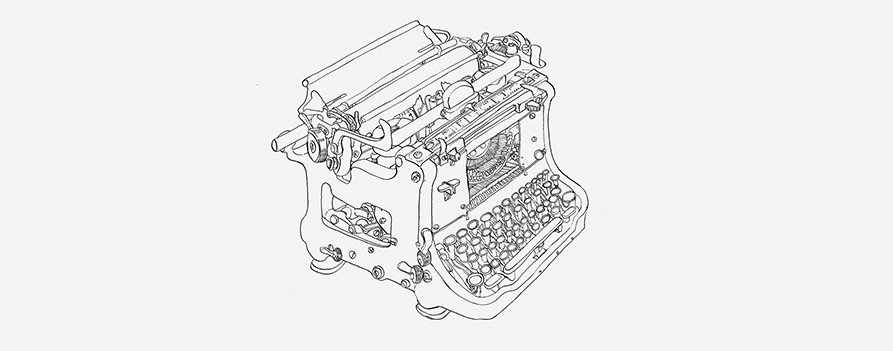

### Hi there 👋
#### ribbit
:frog: check my work!  https://dig-dug.github.io/portfolio/ 
<!--

  
  
  
  
  
  
  
  
  
  
  
  
  

</td><td valign="top" width="25%">

### Backend  

  
  
  
   
  
  
  
  
  
  
  
  

</td><td valign="top" width="25%">  -->
<!--
**Dig-Dug/Dig-Dug** is a ✨ _special_ ✨ repository because its `README.md` (this file) appears on your GitHub profile.

Here are some ideas to get you started:

- 🔭 I’m currently working on ...
- 🌱 I’m currently learning ...
- 👯 I’m looking to collaborate on ...
- 🤔 I’m looking for help with ...
- 💬 Ask me about ...
- 📫 How to reach me: ...
- 😄 Pronouns: ...
- ⚡ Fun fact: ...
-->
<!-- 
</img>
<h2>Skills</h2>
</img></
</img>
</img>
</img>
</img>
</img>
</img>
</img>
</img>
</img>
</img>
</img>

<h2>Profiles</h2>
<a href='https://img.shields.io/badge/-Stackoverflow-FE7A16?style=for-the-badge&logo=stack-overflow&logoColor=white'></img></a>
<a href='https://leetcode.com/vivekjain202/'></img></a>
<a href='https://github.com/vivekjain202'></img></a>
<a href='https://www.hackerrank.com/v_jain_202'></img></a>
 
<h2>Connect with me</h2>

<a href='https://in.linkedin.com/in/vivek-jain-16957a56'></img></a>
<a href='mailto:v.jain.202@gmail.com'></img></a>
<a href='https://twitter.com/vivekjain202'></img></a>

-->
